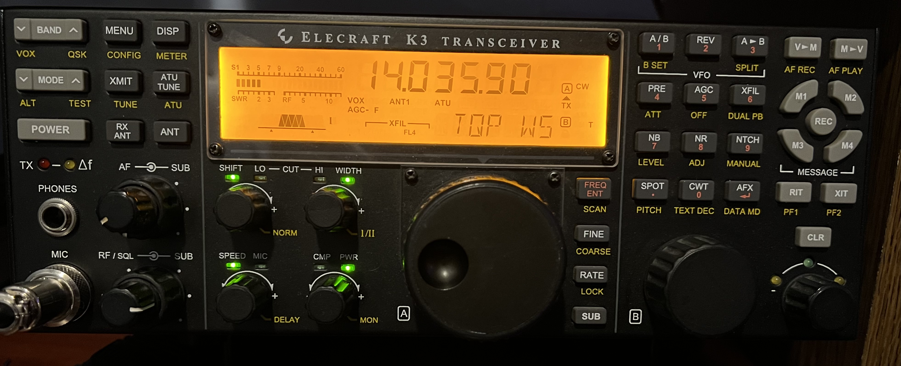
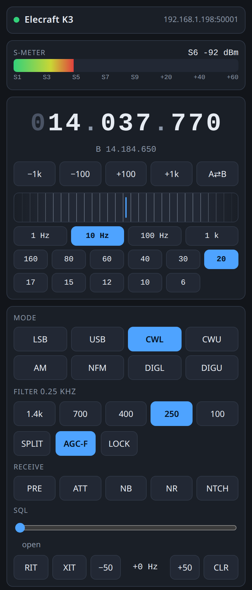
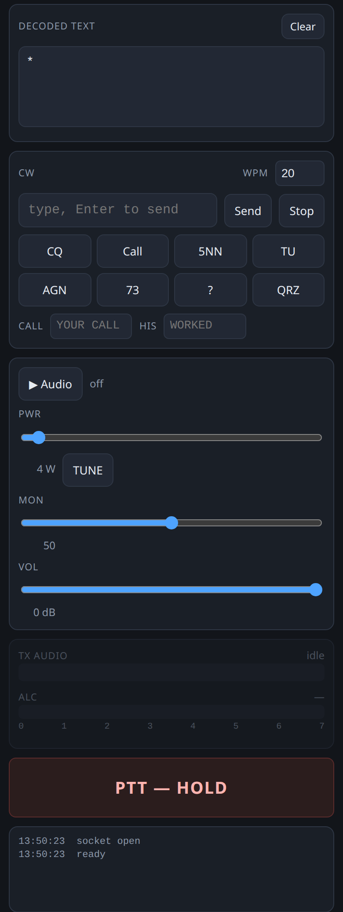

# K3 → TCI Bridge

Turn an Elecraft K3 into a networked remote station, using a Raspberry Pi and
the open **TCI** (Transceiver Control Interface) protocol — no new radio, no
proprietary remote box.



*The radio this bridge drives. The web UI's controls follow its front panel:
BAND, AGC, PRE/ATT, NB, NR, NTCH, RIT/XIT.*

<table>
<tr>
<td></td>
<td></td>
</tr>
</table>

*The web UI on a phone, live against the radio on 20 m CW. It is served by
the bridge itself on port 50001, so nothing needs installing.*

The Pi presents a TCI WebSocket server on port 50001. Any TCI client can
connect for CAT control and two-way audio; a browser-based UI is served from
the same port, so a phone on the LAN needs nothing installed.

Working today: full CAT control, RX and TX audio at 48 kHz, CW keying with
macros, filter and power control, RIT/XIT, band buttons that repair a band
memory left off-band, AGC, preamp, attenuator, NB, NR and notch, S-meter,
PTT with a safety
watchdog, the radio's own decoded CW/RTTY/PSK text, multi-client state
broadcast, and a web UI with a tuning wheel. First on-air CW QSO made through
it on 20 m, and **WSJT-X 3.0.1 runs over TCI** — rig control and audio both,
no sound-card routing.

---

## Why TCI

The K3 has a documented serial CAT interface and (with the USB interface) a
built-in USB audio codec. TCI is an open, documented WebSocket protocol with
existing client software. Bridging one to the other is the cheapest way to
get a modern remote station out of a radio designed before they existed.

Alternatives considered and rejected are recorded in
[`k3-tci-bridge-design.md`](k3-tci-bridge-design.md) — including why the P3
panadapter cannot supply spectrum data, which is worth reading before anyone
repeats that investigation.

---

## Layout

| Path | What |
|---|---|
| [`k3-tci-bridge-design.md`](k3-tci-bridge-design.md) | Scope, hardware, what was ruled out and why |
| [`k3-tci-command-map.md`](k3-tci-command-map.md) | **The reference.** Byte-exact TCI ↔ K3 CAT mapping, global rules, everything verified on hardware |
| [`k3-tci-capability-eval.md`](k3-tci-capability-eval.md) | Measured performance envelope, risks, config |
| [`bridge/`](bridge/) | The bridge itself, the web UI, and its test suite |
| [`tools/`](tools/) | Bench scripts used to establish the findings — see [`tools/README.md`](tools/README.md) |

---

## Hardware

- Elecraft **K3** with the USB interface (FT232 CAT + PCM2901 codec on an
  internal hub). Options here: KAT3A, KPA3A, KXV3, KDVR3, KSYN3A. **No
  sub receiver**, which is why `trx_count` is 1.
- **Raspberry Pi 3B**, Debian 13, 905 MB RAM. Not a constraint: the whole
  audio path costs about 15% of one core.

---

## Measured

| | |
|---|---|
| RX audio | 23.43 frames/s, zero dropped over 60 s |
| Audio jitter | p50 42.9 ms, max 43.8 |
| Server CPU, streaming | 14.8% of one core (~3.7% of a 4-core Pi 3B) |
| CAT round-trip | 15.6 ms p50 (after the FTDI latency-timer fix) |
| Audio bandwidth | 3.07 Mbit/s each way, uncompressed — the gate on real remote use |

---

## Findings worth knowing

These cost real bench time. Several look like typos and are not.

**Plain "CW" on this K3 is the LOWER sideband.** `MD3` → `cwl`, `MD7` →
`cwu` — the opposite of the intuitive guess. Measured against a WWV carrier
by FFT, not assumed ([`tools/wwvtest2.py`](tools/wwvtest2.py)). Getting it
backwards is silently wrong: inverted sideband, no error anywhere.

**`DT` must be set before `MD`.** Norm/reverse is stored per sub-mode *pair*,
so setting `DT` can move `MD` between 6 and 9. Setting `MD` first gets
quietly undone.

**AF GAIN does not affect the USB audio at all** — 0.6 dB across `AG000`
to `AG250`. LINE OUT is a fixed-level tap. The hardware control is `LIN OUT`
(menu 032), which is a one-time calibration; TCI `volume` is applied in
software.

**Two radio settings fail with no error at all:**
- `MIC+LIN` (menu 015) must be ON, or USB audio never reaches the modulator.
- CW VOX (`VX1`) must be on, or `KY` text is buffered and never transmitted.

**Text decode is a front-panel setting with no CAT command, and its "off"
is indistinguishable from silence.** `TB;` reads the K3's decoded text, but
nothing enables the decoder remotely — hold **TEXT DEC** at the radio and
select `CW 5-40`. A radio with it switched off answers `TB000;`, which is
byte for byte what a radio with it on and a quiet band answers. The bridge
does not guess; the web UI states both possibilities rather than showing an
empty box that reads as broken.

**`TB`'s decoded text can contain semicolons**, which is what everything
else on the CAT link uses as its terminator. That is why the reply carries a
character count, and why it is the one command the reader does not frame on
`;`. Getting it wrong truncates the text *and* injects the tail into the
command stream.

**A CAT SET can be dropped silently.** An `MD2;` was ignored with no `?;`
and no other sign. Anything whose failure corrupts later decisions needs
set-verify-retry.

**WSJT-X transmits silence without TX_CHRONO.** It does not stream TX audio
freely — it waits to be asked, via a header-only type-3 frame every 21.33 ms.
A server that never sends them sees the client key up correctly and put out
nothing, with no error at either end.

**The ALSA period must equal the TCI frame size.** A mismatched period
injected 85 ms of latency while CPU stayed near zero — the risk in the audio
path was never CPU.

**The S-meter → dBm conversion needed a signal generator.** Two attempts
to verify it against the radio's 10 dB attenuator gave irreconcilable
answers, because the WWV signal used as a reference faded more than the
step being measured. A generator sweep, with an Elecraft P3 as the level
reference, then showed the documented anchors reading 3-8 dB low. S9 sits
at SMH 37, not 40, and the slope bends at SMH 55. `rx_smeter` now uses the
measured curve: 0.81 dB rms from -115 to -20 dBm, at 14 MHz with preamp
and attenuator off (`tools/README.md`).

---

## Method note

Nearly every wrong answer in this project came from measuring without a
control, and every one was caught by adding one:

- A sideband test that looked conclusive was measuring WWV's modulation
  tones instead of its carrier, because it searched for the strongest peak
  rather than energy at the predicted frequency.
- A "TX audio works" result was ALC responding to something that was not the
  test tone — silence deflected the meter identically.
- An S-meter calibration was measuring propagation, not the attenuator.

The tools in [`tools/`](tools/) run their controls first and abort if the
controls fail. That is the part worth copying.

---

## Getting started

See [`bridge/README.md`](bridge/README.md) for install, the systemd unit, the
udev rule, and the required radio settings.

Short version, on the Pi:

```sh
python3 -m venv --system-site-packages venv
./venv/bin/pip install websockets
./venv/bin/python server.py
```

Then open `http://<pi>:50001/`.

---

## Clients

- The built-in **web UI** — nothing to install, works on a phone on the LAN.
  This is the primary client.

  On iPhone, audio used to be silent whenever the ring/silent switch was set
  to silent: iOS puts a bare `AudioContext` in the *ambient* audio session
  category, which that switch mutes. Everything else worked, which made it
  look like an audio-path fault rather than a phone setting. Fixed by
  requesting the `playback` category. If a browser fault ever looks like a
  transport problem, note that HTTPS upgrading and iOS Local Network
  permission are both dead ends — see [`bridge/README.md`](bridge/README.md)
  for why.
- **WSJT-X 3.0.1** — set the rig to the TCI/ExpertSDR option pointed at
  `<pi>:50001`, tick *Use TCI Audio*, and put the radio in DIGU. Confirmed
  working. Needs the TX_CHRONO clock, which is why it exists here.
- [`bridge/tciplay.py`](bridge/tciplay.py) — a ~90-line headless listener,
  useful for checking the audio path from another machine.

Any TCI-capable client should work: everything the bridge implements is
standard TCI, with a single deliberate exception. TCI has no message for
decoded text, so `rx_text:0,<text>` is the bridge's own — a client that does
not know it ignores it, which is why it rides the existing socket instead of
a second channel. Nothing else on the wire is bespoke. Third-party clients
are not bundled here.

---

## Licence

MIT — see [`LICENSE`](LICENSE). The Elecraft and TCI protocol documentation
referenced here belongs to its respective authors and is not redistributed.

## Not implemented

Browser microphone TX (needs HTTPS/WSS for a secure context), and
IQ/panadapter — the last deliberately, since the P3 cannot supply the data
and the KXV3 IF path needs added hardware. See the capability evaluation
for the analysis.

`agc_mode`, squelch, the noise blanker and VFO lock are all mapped
byte-exact in the command map and have no handler yet; each is a small
addition on the same pattern as RIT/XIT.
